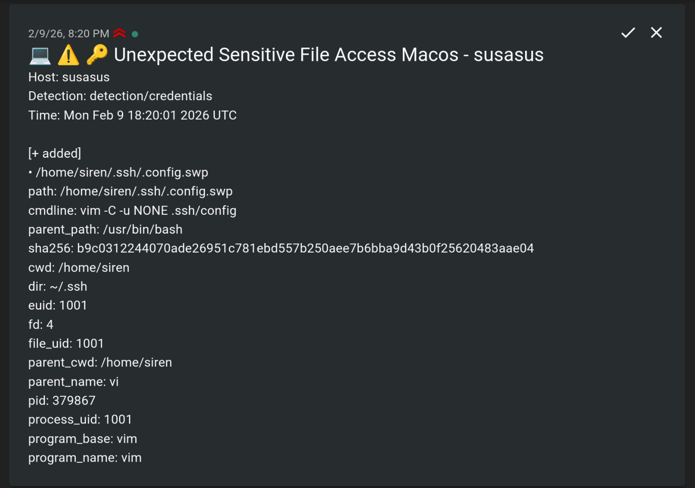

# FleetDM ntfy Webhook

A lightweight Go service that receives [FleetDM](https://fleetdm.com/) webhook payloads and forwards them as formatted notifications to [ntfy](https://ntfy.sh/).



## Features

- Dynamically parses any FleetDM query/detection type
- Priority-based alerting (c2/execution/exfil = urgent, persistence/credential = high)
- Groups events by action (added/removed)
- Prioritizes important fields (path, cmdline, user, network info)
- Filters out noisy/empty fields

## Configuration

| Environment Variable | Default | Description |
|---------------------|---------|-------------|
| `LISTEN_ADDR` | `:8080` | Server listen address |
| `NTFY_URL` | `https://ntfy.sh` | ntfy server URL |
| `NTFY_TOPIC` | `fleet-alerts` | ntfy topic name |

## Usage

### Docker

```bash
docker run -d \
  -e NTFY_URL=https://ntfy.example.com \
  -e NTFY_TOPIC=fleet-alerts \
  -p 8080:8080 \
  ghcr.io/rastersec/fleetdm-ntfy-webhook:latest
```

### Docker Compose

```yaml
fleet-ntfy-webhook:
  image: ghcr.io/rastersec/fleetdm-ntfy-webhook:latest
  restart: unless-stopped
  environment:
    - NTFY_URL=https://ntfy.example.com
    - NTFY_TOPIC=fleet-alerts
    - LISTEN_ADDR=:8080
  ports:
    - "8080:8080"
```

### Binary

```bash
NTFY_URL=https://ntfy.example.com NTFY_TOPIC=fleet ./fleet-ntfy-webhook
```

## FleetDM Configuration

In FleetDM, configure a webhook destination pointing to:

```
http://your-server:8080/webhook
```

## Building

```bash
go build -o fleet-ntfy-webhook .
```

Or with Docker:

```bash
docker build -t fleet-ntfy-webhook .
```

## License

MIT
